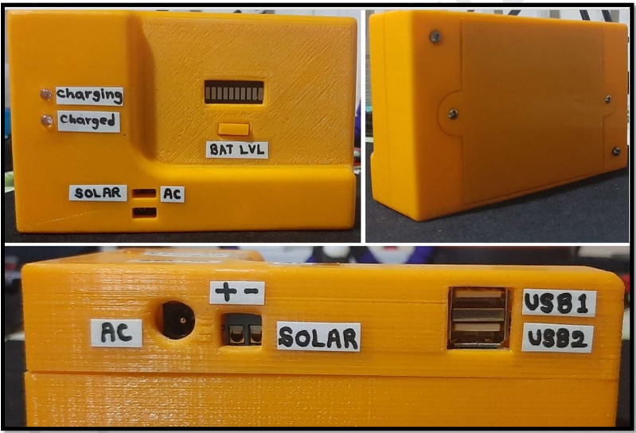
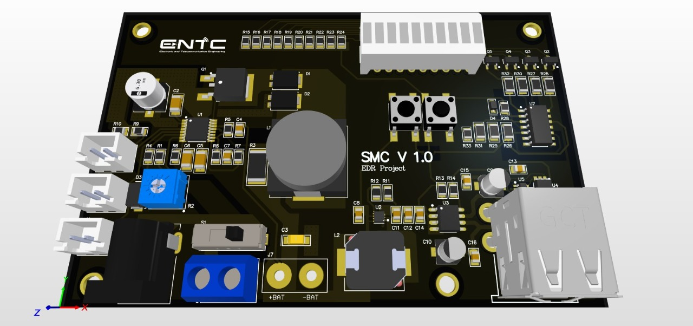
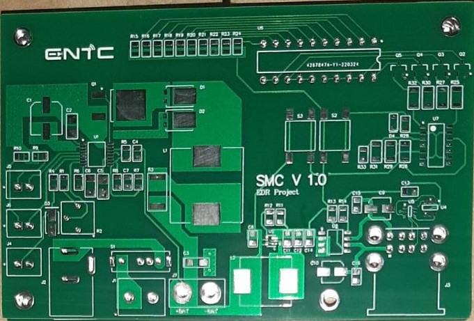
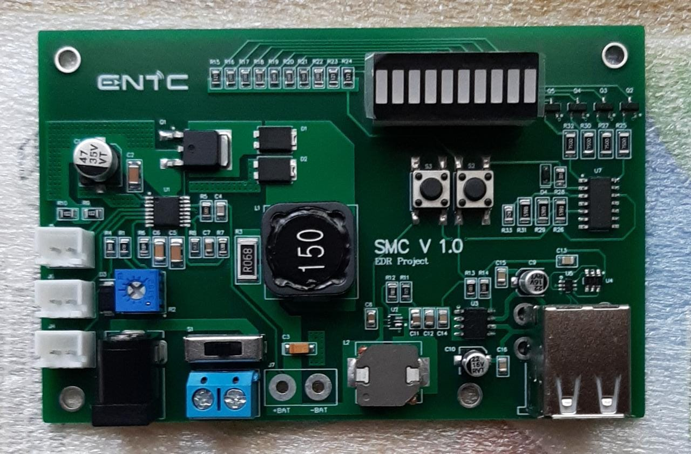
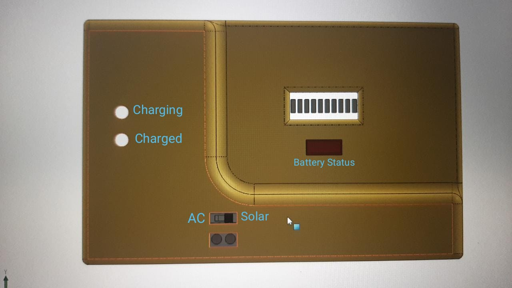

# SOLAR BANK - Portable Solar Charger

<!-- PROJECT LOGO -->
 

  
  <h3 align="center">SOLAR BANK</h3>

# About The Project

  

* This repository includes all the project files related to the development of a portable solar charger; Solar Bank. 
* The project was done by a team of 10 undergraduates at the Department of Electronic and Telecommunication Engineering, University of Moratuwa, Sri Lanka for UOM's EN3023 - Electronic Design Realization module.
* We Designed a portable mobile charger capable of powering small electronic devices which can be charged by solar cells or AC power. This device can be carried while hiking, traveling or can be installed in public places even at home.
* `Altium Designer` and `SolidWorks` were used to design the circuit designs and the enclosure designs.

# Printed Circuit Board (PCB)

|*3D Layout*|*Before Soldering*|*After Soldering*|
|:----:|:----:|:----:|
|  |||

# Enclosure

|*SolidWork Design*|*Before Printing*|*After Printing*|
|:----:|:----:|:----:|
|  |||

### Contributors

1. [Muhammad Aqeel](https://github.com/AqeelMuhammad)
1. [Charith Janaka](https://github.com/charithjanaka)
1. [Tharuka Nilupul](https://github.com/TharukaN17)
1. [Isuru Dilshan Wijethunga](https://github.com/IsuruWijethunga)
1. [Dilun Sandeepa](https://github.com/Diluwas)
1. [Navindu Rasanjana](https://github.com/NavinduRasanjana)
1. [Dulsara Gimhana](https://github.com/Dulsara20059)
1. [Aruna Lakpriya](https://github.com/aruna-lakpriya)
1. [Kaveesha Yalegama](https://github.com/Kaveesha-98)
1. [Janitha Vidunath](https://github.com/JanithaVidunath)
